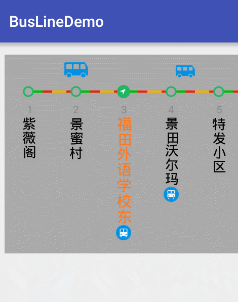

# BusLine
仿《车来了》公交线路自定义View，根据线路数据绘制View并控制滑动手势。

### 效果
先看最终运行效果：



### 使用

* XML布局：

```xml
<?xml version="1.0" encoding="utf-8"?>
<RelativeLayout
    xmlns:android="http://schemas.android.com/apk/res/android"
    xmlns:tools="http://schemas.android.com/tools"
    android:layout_width="match_parent"
    android:layout_height="match_parent"
    android:paddingBottom="@dimen/activity_vertical_margin"
    android:paddingTop="@dimen/activity_vertical_margin"
    android:paddingLeft="@dimen/activity_vertical_margin"
    android:paddingRight="@dimen/activity_vertical_margin"
    >

    <com.jacpy.busline.widget.BusLineView
        android:layout_width="wrap_content"
        android:layout_height="wrap_content"
        android:id="@+id/bus_line"
        android:background="@android:color/darker_gray"
        />

</RelativeLayout>

```
* 在代码中使用：

```java
BusLineView view = (BusLineView) findViewById(R.id.bus_line);
view.setBusLineData(initData()); // 设置数据
view.setOnBusStationClickListener(this); // 设置公交站点的点击事件
```

* 性能
在2013年的机型MOTO G XT1032机子上运行，同时刷新96个公交站点数据，onDraw()方法耗时平均7ms左右。

### 实现原理

站点信息使用android系统中的绘图部分API，位置是通过大小及顺序计算位置坐标。手势滑动使用的是android系统中的Touch事件控制及Scroller滚动实现。


### 关于

[jacpy](http://www.jacpy.com)

### License
本项目遵守Apache 2.0 license。

